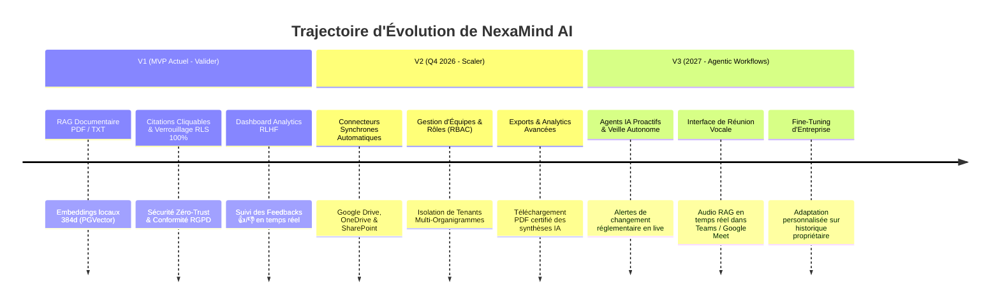

# Bilan Technique, Justification des Choix & Roadmap d'Évolution (s69)

Ce document retrace la genèse, l'ingénierie architecturale et les perspectives futures du projet **NexaMind AI**, réalisé selon le référentiel d'exigence **BMAD (Build, Measure, Analyze, Document)**.

---

## 1. Déroulé et Construction du Projet (Séquences 1 à 7)

La réalisation de NexaMind AI s'est déroulée en 7 séquences itératives et rigoureuses :
1. **Séquence 1 (Cadrage) & Séquence 2 (Architecture Stack) :** Avant d'écrire une seule ligne de code, nous avons posé le socle théorique : analyse des irritants B2B (perte de temps documentaire), modélisation relationnelle en 10 tables sur PostgreSQL, et définition d'un contrat de sécurité strico-sensu.
2. **Séquence 3 (Socle Fullstack) & Séquence 4 (IA Conversationnelle) :** Mise en place d'une application Next.js avec interface en verre dépoli (Glassmorphism), authentification Supabase Auth et connexion en streaming au Vercel AI SDK et aux LLM.
3. **Séquence 5 (Le Cœur RAG & PGVector) :** Intégration du découpage en chunks, de la vectorisation, et de trois fonctionnalités phares en un clic sur les documents (Résumé automatique, extraction des points clés, et suggestion sémantique de documents en relation via la fonction SQL RPC `get_related_resources`).
4. **Séquence 7 (Sécurité, RGPD & RLHF) :** Finalisation de l'expérience d'entreprise avec l'intégration des évaluations en boucle courte 👍/👎, l'audit 360° du Row Level Security (RLS) sur les 10 tables, et le respect juridique des directives européennes (RGPD, contrat Zero Data Retention ZDR).

---

## 2. Justification Clinique de notre Stack Technique

Chaque brique technologique a été sélectionnée après arbitrage face aux alternatives du marché pour offrir le meilleur compromis entre performance, coût opérationnel (FinOps), et sécurité des données d'entreprise (SecOps).

| Brique de la Stack | Choix Retenu | Justification Technique & Avantages sur la concurrence |
| :--- | :--- | :--- |
| **Framework Fullstack** | **Next.js 15 (App Router)** | Permet d'unifier l'interface utilisateur (React Server Components pour des rendus rapides et un SEO optimal) et la couche API backend (Route Handlers) dans un seul dépôt monolithe scalable, réduisant la complexité de maintenance et facilitant le déploiement sur Vercel. |
| **Base de Données & Auth** | **Supabase (PostgreSQL)** | Offre la robustesse d'un PostgreSQL natif doté d'une gestion granulaire de sécurité au niveau de chaque ligne (Row Level Security - RLS). Surpasse les alternatives NoSQL (Mongo, Firebase) pour le relationnel complexe, et garantit l'hébergement ISO-27001 en Union Européenne. |
| **Moteur Vectoriel (RAG)** | **PGVector (intégré à Supabase)** | Au lieu d'adopter une base vectorielle externe dédiée et coûteuse (Pinecone, Weaviate, Milvus) qui dupliquerait les flux de données et induirait une latence réseau, PGVector permet de stocker les embeddings *au même endroit* que les tables de documents et de chatter via des jointures SQL natives. |
| **Génération d'Embeddings** | **`@xenova/transformers` (`gte-small`)** | **Choix décisif pour la confidentialité et le coût :** Plutôt que de faire appel à l'API payante `text-embedding-3-small` d'OpenAI qui expose les segments de texte de l'entreprise sur le web, notre backend exécute localement le modèle `gte-small` (384 dimensions) en TypeScript. Zéro coût externe, latence minimale, intimité absolue. |
| **Moteur IA & Streaming** | **Vercel AI SDK & OpenRouter** | Agnostique des fournisseurs d'IA. Le Vercel AI SDK assure un affichage fluide mot par mot en streaming avec gestion de statut d'erreur et intégration aisée des citations documentaires. OpenRouter offre un pont résilient vers les meilleurs LLM du marché (Gemini 2.5, GPT-4o, DeepSeek, Llama 3) avec une garantie de Zero Data Retention. |

---

## 3. Du MVP aux Versions Supérieures (V1 ➔ V2 ➔ V3)

Afin d'inscrire NexaMind AI dans une trajectoire pérenne de croissance SaaS et de conquête de comptes clients de niveau Étoile/Enterprise, la feuille de route d'évolution se décline en trois stades d'maturité.



### Détail des Évolutions Majeures en V2 & V3 :
1. **La V2 (Échelle de l'Organisation & Synchronisation) :**
   * **Connecteurs d'Entreprise :** Actuellement, le MVP repose sur l'import manuel d'un fichier par un utilisateur. La V2 introduira des webhooks et des scripts d'indexation automatiques branchés sur Google Drive et SharePoint. Dès qu'un fichier y est déposé ou mis à jour par le service juridique ou RH, NexaMind AI re-vectorise en silence.
   * **RBAC (Role-Based Access Control) :** Transition du RLS centrée sur l'utilisateur individuel vers un RLS hiérarchique : création d'équipes au sein d'une organisation, avec des droits discriminés (Ex : les documents RH confidentiels ne peuvent être interrogés en RAG que par les profils estampillés "Direction" ou "RH").

2. **La V3 (L'Ère des Workflows Agentiques) :**
   * **Agents Proactifs :** Plutôt que de rester en mode réactif (attendre une question du collaborateur), des sous-agents autonomes interrogeront la base vectorielle lors de l'arrivée de nouveaux décrets de lois pour pointer automatiquement les paragraphes impactés dans le recueil interne des procédures de l'entreprise.

---

## 4. Guide de Publication & Déploiement Cloud (Vercel)

Dès la clôture de la présentation, l'application est configurée pour être déployée publiquement en quelques clics sur **Vercel** (l'infrastructure native de Next.js).

### Procédure Étape par Étape :
1. **Connexion Vercel ➔ GitHub :**
   * Se rendre sur `https://vercel.com` et sélectionner **"Add New Project"**.
   * Importer le dépôt officiel : **`tennessyk-pixel/Nexamind-ai`**.
2. **Configuration du Framework & Variables d'Environnement :**
   * Vercel détecte automatiquement Next.js et exécute `npm run build`.
   * Dans la section **Environment Variables**, copier-coller les clés présentes en production dans Supabase et OpenRouter :
     ```text
     NEXT_PUBLIC_SUPABASE_URL = <URL_SUPABASE>
     NEXT_PUBLIC_SUPABASE_ANON_KEY = <CLE_ANON_SUPABASE>
     SUPABASE_SERVICE_ROLE_KEY = <CLE_SERVICE_ROLE_SUPABASE>
     OPENAI_API_KEY = <CLE_OPENROUTER_OU_GEMINI>
     NEXT_PUBLIC_APP_URL = https://nexamind-ai.vercel.app
     ```
3. **Mise en Ligne & Optimisation Edge :**
   * Cliquer sur **Deploy**. En moins de 2 minutes, le compilateur Rust de Next.js génère les bundles Edge Serverless et attribue un domaine public sécurisé HTTPS (`https://nexamind-ai.vercel.app`).
4. **Mise à Jour Supabase Auth :**
   * Dans le tableau de bord Supabase > Authentication > URL Configuration, ajouter la nouvelle URL Vercel dans la liste des **Site URL** et **Redirect URLs** autorisées afin que les redirections après connexion ou validation d'e-mail opèrent impeccablement dans le cloud.

---
*Document validé comme livrable final de clôture du Runbook NexaMind AI (s69).*
